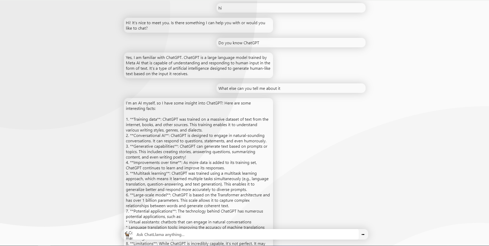

# ChatLlama 🦙 - AI chat bot inspired by ChatGPT running Llama 3 locally

ChatLlama is an AI chat bot inspired by ChatGPT running Llama 3 locally on an Ollama Server via Docker

## How It Works

Live demo here.

The app is powered by:

- 🦙 Ollama for AI model serving & prompting
- 🔋 MySQL for DB & Auth


## Running Locally (*without* Docker)

#### 1. Clone Repository
```
git clone https://github.com/YanSchw/ChatLlama.git
```

#### 2. Provide a running Ollama server and MySql Database yourself

#### 3. Package the application
```
mvn clean package -DskipTests=true
```

#### 4. Run the application and provide secrets as Program Arguments
These are the default secrets, you may override these as you like:
```
java -jar target/chatllama-0.0.1-SNAPSHOT.jar 
-CHATLLAMA_PORT 8080
-OLLAMA_HOSTNAME "http://localhost"
-OLLAMA_PORT 11434
-MYSQL_HOSTNAME "jdbc:mysql://localhost"
-MYSQL_PORT 3306
-MYSQL_USERNAME "root"
-MYSQL_PASSWORD "1234"
```

## Running Locally (*with* Docker)

#### 1. Clone Repository
```
git clone https://github.com/YanSchw/ChatLlama.git
```

#### 2. Ensure Docker Engine is running

#### 3. Run the deployment script
```
deploy.bat
```
```
deploy.sh
```